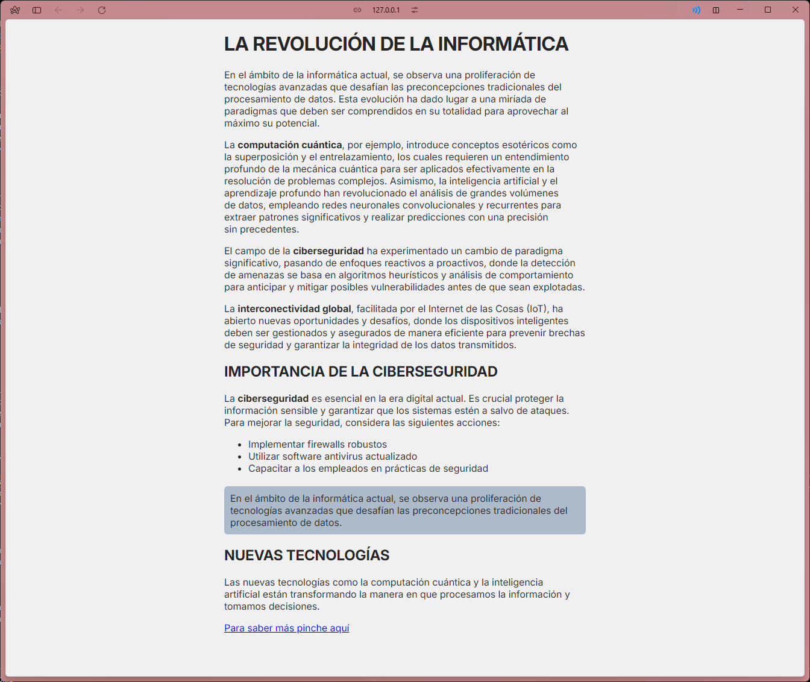
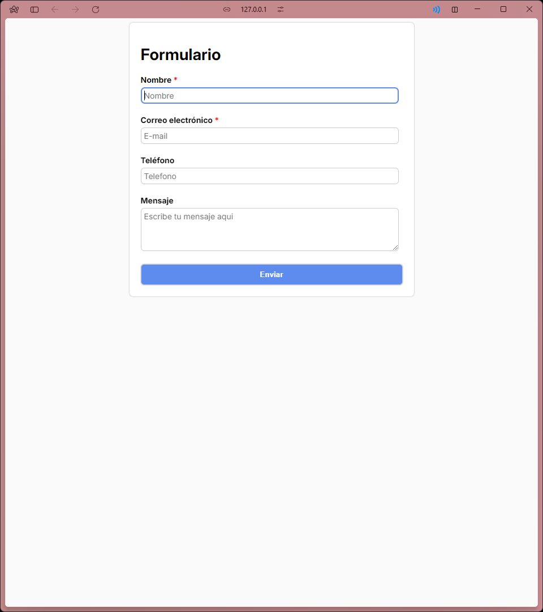
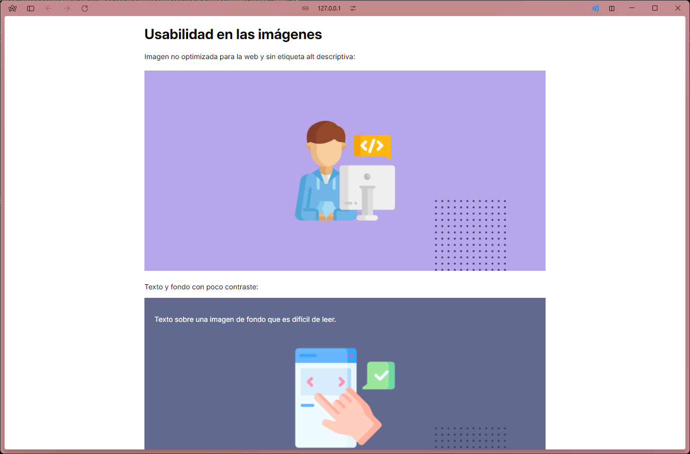
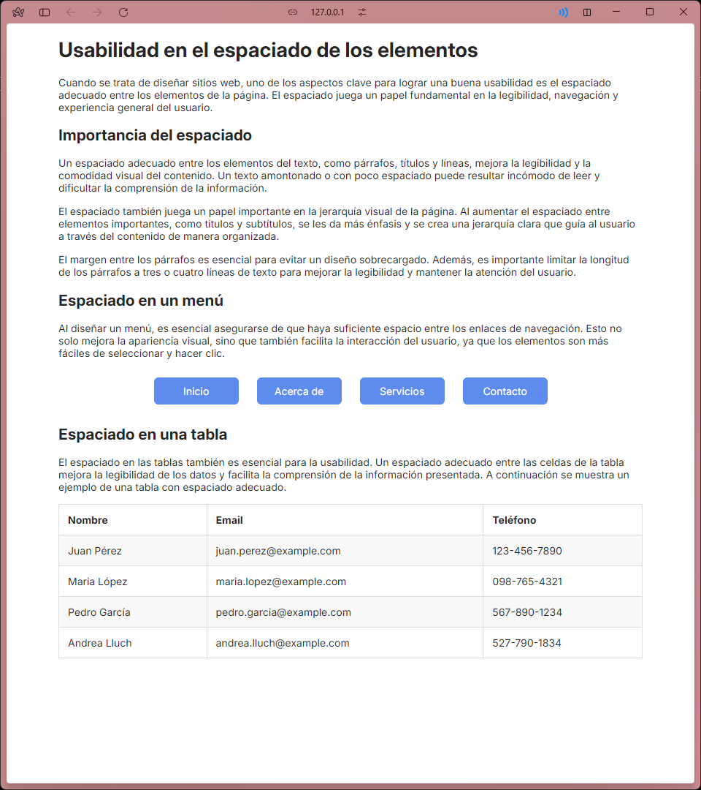

# Explicaciones

## Usabilidad en los textos

El primer paso en este apartado es cambiar la fuente por una más legible. En el css se importa la siguiente fuente.

```
@import url('https://fonts.googleapis.com/css2?family=Inter:ital,opsz,wght@0,14..32,100..900;1,14..32,100..900&display=swap');
```

También cambiamos el color a uno más contrastado para que la lectura sea más fácil. Cambiamos el color de fondo de la caja con texto para que sea más fácil la lectura.

También facilita la lectura el hacer énfasis en palabras claves. Y por último el enlace lo agrandamos para que el usuario tenga una mayor facilidad al hacer click.

El resultado es el siguiente.



Como se puede ver el tamaño del texto es uniforme y se utilizan las etiquetas correctas.

## Usabilidad en los formularios

Al igual que en el anterior, cambiamos la fuente. Después de esto podemos hacer que todos los campos del formulario tengan el mismo tamaño.

Nos aseguramos que se utilizan la fuente y el tamaño en el `textarea` y los `input`.

```
 font-size: inherit;
 font-family: inherit;
```

Para facilitar al usuario hacer click en el botón, hacemos que ocupe el 100% del contenedor.

El resultado es el siguiente.



Como se puede ver todos los campos son uniformes, la fuente que utilizan es la misma en todo el documento, y hemos añadido asteriscos a los campos requeridos.

## Usabilidad en las imágenes

En este apartado, lo principal es el tamaño de la primera imagen, la cual no tiene el 100% de la anchura del contenedor al que pertenece.

El otro punto es el color de la fuente por encima de la imagen, que tan solo cambiando a un color mas ligero se soluciona.

El resultado es el siguiente.



## Usabilidad en el espaciado de elementos

Al igual que con el primer apartado, el espaciado entre los párrafos es clave.

Además de esto, el espaciado en botones también ayuda a que sean más fáciles de usar, podemos ver que los botones están centrados, y con un espaciado y tamaño uniformes. Para mejorar esto aún más, utilizando la propiedad `:hover`, podemos hacer que se vea mejor la opción que el usuario va a elegir.

El resultado es el siguiente.



A la tabla se le ha aumentado el tamaño y añadido colores distintos entre las celdas pares e impares para diferenciar un poco entre ellas, facilitando la lectura.